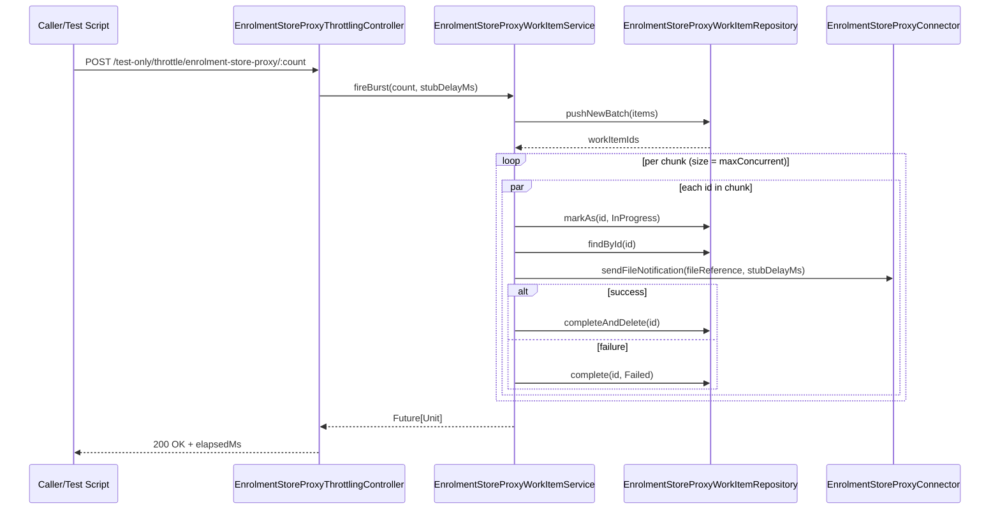

# WorkItem Throttling Overview

This document explains how the current WorkItem-based throttling flow works in this service, and how it maps to the current code.

## What changed

The service no longer uses token-bucket rate limiting for enrolment-store-proxy calls. Instead, it:

- persists outbound work as Mongo WorkItems,
- processes WorkItems in deterministic chunks,
- enforces concurrency using `max-concurrent` only.

Current config key in `conf/application.conf`:

```hocon
throttle.enrolment-store-proxy.max-concurrent = 4
```

## End-to-end flow

```text
Client / test script
        |
        v
POST /test-only/throttle/enrolment-store-proxy/:count
(EnrolmentStoreProxyThrottlingController.fireBurst)
        |
        v
EnrolmentStoreProxyWorkItemService.fireBurst(count, stubDelayMs)
        |
        +--> Build payloads with batchId + fileReference + stubDelayMs
        |
        +--> repository.pushNewBatch(items)   [Mongo WorkItems persisted]
        |
        +--> grouped(maxConcurrent)           [chunking]
        |
        +--> processChunk(chunk1) -> processChunk(chunk2) -> ...
                         |                    |
                         v                    v
                  processWorkItem(id)   processWorkItem(id)
                         |
                         v
             EnrolmentStoreProxyConnector.sendFileNotification(...)
                         |
                         +--> success: repository.completeAndDelete(id)
                         +--> failure: repository.complete(id, Failed)
```

## Concurrency model (current implementation)

Chunking is the concurrency control.

- Chunk size = `maxConcurrent`
- Requests inside one chunk run in parallel (`Future.traverse`)
- Chunks run sequentially (`foldLeft` chain)

```text
Example: count=10, maxConcurrent=4

Chunk 1: [1,2,3,4]  -> run in parallel
Chunk 2: [5,6,7,8]  -> starts only when Chunk 1 completes
Chunk 3: [9,10]     -> starts only when Chunk 2 completes
```

## Sequence diagram (runtime behavior)



## Observability diagram

`GET /admin/throttle/status` in `app/uk/gov/hmrc/eacdfileprocessor/controllers/DiagnosticsController.scala` returns a computed snapshot:

```text
inProgress = repository.count(InProgress)
availablePermits = max(0, maxConcurrent - inProgress)

response.enrolmentStoreProxy = {
  maxConcurrent,
  availablePermits,
  currentlyProcessing = inProgress,
  maxPerSecond = 0,
  tokensRemainingThisSecond = -1
}
```

Notes:
- `maxPerSecond` and `tokensRemainingThisSecond` are legacy fields kept for response compatibility.
- They are not used for runtime control in WorkItem mode.

## Code map (where to look)

- Trigger endpoint:
  - `app/uk/gov/hmrc/eacdfileprocessor/controllers/testonly/EnrolmentStoreProxyThrottlingController.scala`
  - method: `fireBurst`

- Core WorkItem orchestration:
  - `app/uk/gov/hmrc/eacdfileprocessor/services/EnrolmentStoreProxyWorkItemService.scala`
  - methods: `fireBurst`, `processChunk`, `processWorkItem`, `getThrottlingStatus`

- Monitoring endpoint:
  - `app/uk/gov/hmrc/eacdfileprocessor/controllers/DiagnosticsController.scala`
  - method: `throttlingStatus`

- Config source:
  - `app/uk/gov/hmrc/eacdfileprocessor/config/AppConfig.scala`
  - key: `maxConcurrentEnrolmentStoreProxyRequests`

## Practical behavior summary

```text
More files in a burst
    -> more WorkItems persisted
    -> same maxConcurrent cap
    -> more sequential chunks
    -> longer total completion time
```

This gives predictable downstream pressure and keeps behavior stable across restarts because work is persisted in MongoDB.
